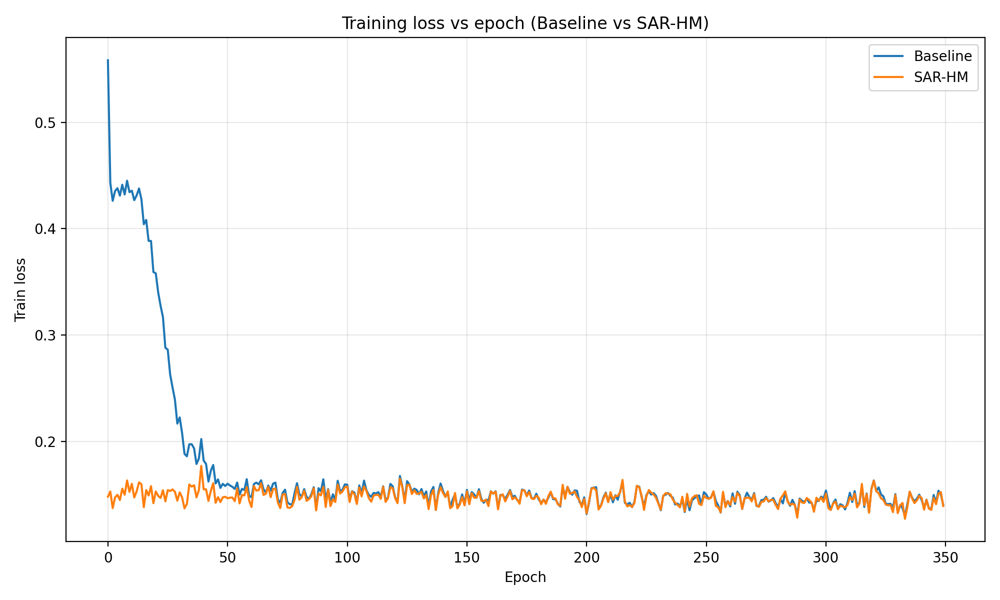
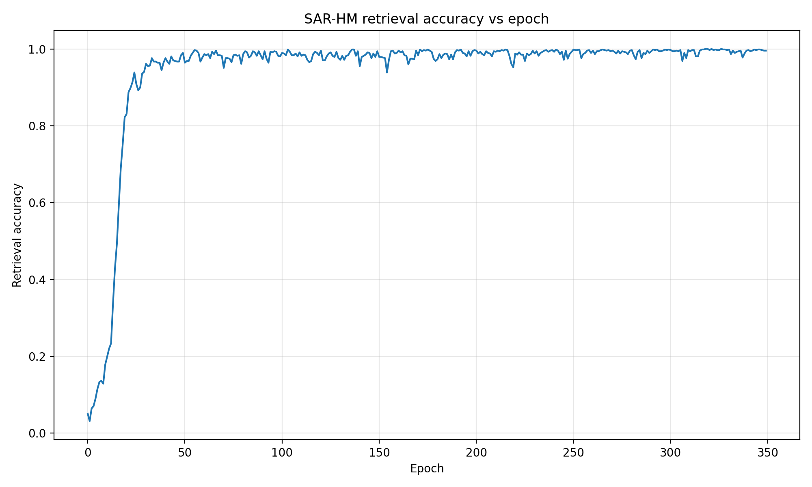
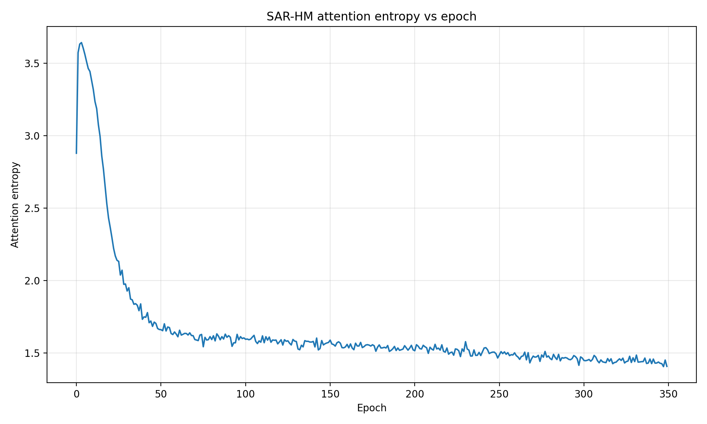
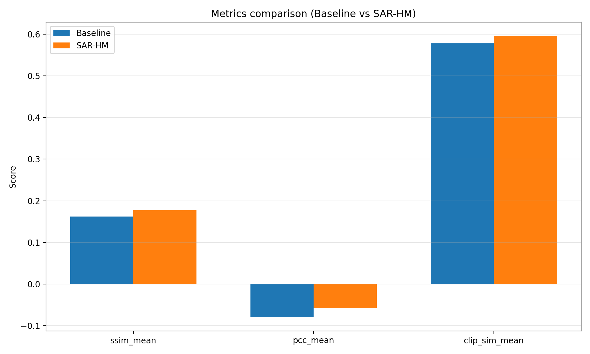
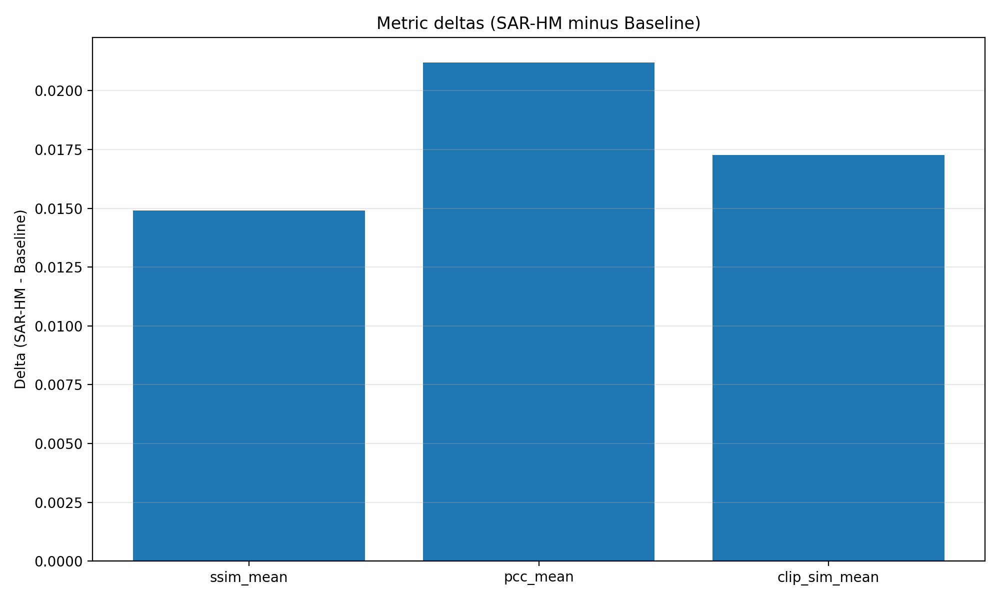
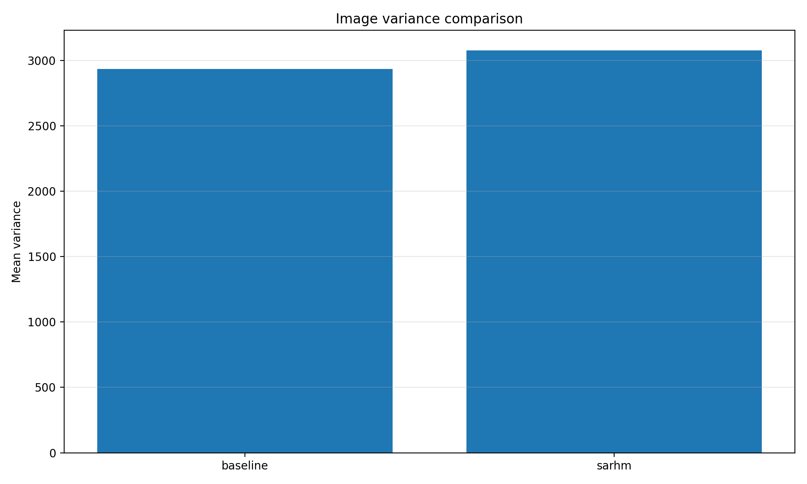
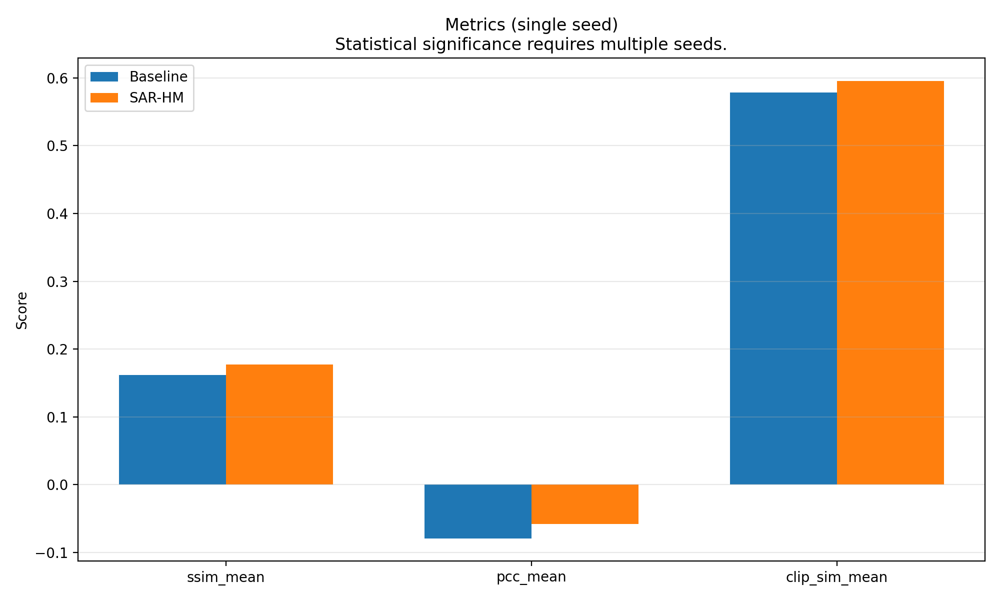
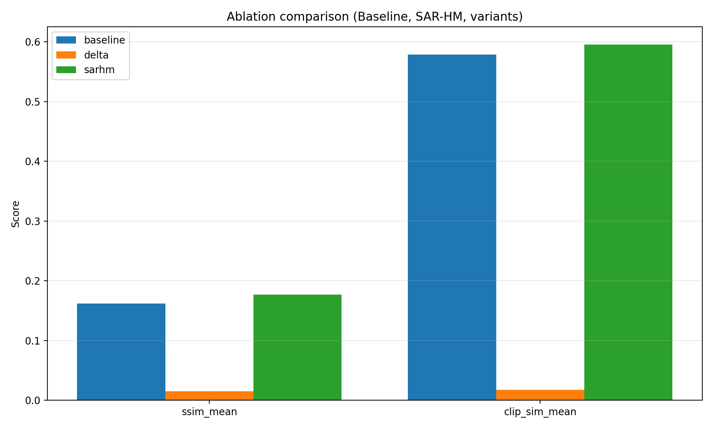

# DreamDiffusion + SAR-HM + SAR-HM++: EEG-to-Image Generation

DreamDiffusion is an **EEG-conditioned** variant of Stable Diffusion that reconstructs visual stimuli from brain signals. This repository contains:

- **Baseline DreamDiffusion** (EEG → conditioning → SD 1.5 UNet)
- **SAR-HM** (*Semantic Associative Retrieval with Hopfield Memory*) — class prototypes + Hopfield retrieval + confidence-gated fusion
- **SAR-HM++** (*Multi-Level Semantic Prototype Retrieval*) — multi-level semantic memory, top-k retrieval, semantic adapter, and optional **semantic teacher supervision** (L_sem_align, L_retr, L_clip_img, L_clip_text from decoded generated images)
- End-to-end scripts for **training** (Stage A1 + Stage B), **generation/evaluation** (Stage C), and **baseline vs SAR-HM vs SAR-HM++ comparison + plotting** (no retraining needed once results exist)

> **Note:** `datasets/` and `pretrains/` are not included in the repo. See **Data & Pretrained Weights** below.

---

## Table of Contents

- [Pipeline Overview](#pipeline-overview)
- [Quickstart](#quickstart)
- [Stages](#stages)
  - [Stage A1: EEG Encoder Pretraining](#stage-a1-eeg-encoder-pretraining)
  - [Stage B: Fine-tuning Stable Diffusion](#stage-b-fine-tuning-stable-diffusion)
  - [Stage C: EEG-to-Image Generation & Evaluation](#stage-c-eeg-to-image-generation--evaluation)
  - [Compare-Eval: Baseline vs SAR-HM vs SAR-HM++](#compare-eval-baseline-vs-sar-hm-vs-sar-hm)
  - [Graphs: Thesis-Quality Plots](#graphs-thesis-quality-plots)
- [Unified Benchmark (EEG2Image, DreamDiffusion, SAR-HM)](#unified-benchmark-eeg2image-dreamdiffusion-sar-hm)
- [Results (Thesis Runs)](#results-thesis-runs)
- [Repository Structure](#repository-structure)
- [Data & Pretrained Weights](#data--pretrained-weights)
- [Reproducibility Checklist](#reproducibility-checklist)
- [Switching Modes (Baseline vs SAR-HM)](#switching-modes-baseline-vs-sar-hm)
- [Architecture Diagram Placeholder](#architecture-diagram-placeholder)

---

## Pipeline Overview

**Stages**

- **Stage A1**: Pre-train an EEG encoder (masked modeling / representation learning).
- **Stage B**: Fine-tune a Latent Diffusion Model (Stable Diffusion 1.5 backbone) using EEG conditioning:
  - **Baseline**: original DreamDiffusion EEG-conditioning path
  - **SAR-HM**: CLIP-space projection + Hopfield retrieval over class prototypes + confidence-gated fusion
  - **SAR-HM++**: multi-level semantic prototypes + semantic query → top-k retrieval → adapter → confidence-gated fusion; optional **semantic targets in batch** (z_sem_gt, clip_img_embed_gt, summary_embed_gt) and **CLIP losses on decoded generated images** (L_clip_img, L_clip_text) for better semantic fidelity
- **Stage C**: Generate images from EEG and compute metrics using saved checkpoints. **Inference is EEG-only** (no GT semantic leakage).
- **Compare-eval + graphs**: Create **final tables/figures** from existing outputs; supports baseline vs SAR-HM vs SAR-HM++ (no retraining).
- **Unified Benchmark**: Fair comparison of **EEG2Image** (TensorFlow baseline), **DreamDiffusion baseline**, and **DreamDiffusion + SAR-HM** on **ImageNet-EEG** and the **ThoughtViz dataset** (pickle + class images; dataset name `thoughtviz`). Single sanity test, small runs, metrics, tables, and qualitative panels. See [Unified Benchmark](#unified-benchmark-eeg2image-dreamdiffusion-sar-hm), `docs/EEG2Image_integration.md`, and `docs/benchmark_workflow.md`. *EEG2Image is a standalone baseline, not part of the diffusion training code. SAR-HM++ is separate (future work).*

---

## Quickstart

All commands assume you are in the **repository root**.

### 1) Environment (Python 3.10/3.11, GPU recommended)

```bash
python -m venv venv
source venv/bin/activate        # Linux/Mac
# or: venv\Scripts\Activate.ps1 # Windows PowerShell

python -m pip install --upgrade pip setuptools wheel
pip install torch torchvision torchaudio --index-url https://download.pytorch.org/whl/cu118
pip install -r requirements.txt
pip install -e ./code
```

### 2) Data & checkpoint layout (required paths)

Place the following at the **repository root**:

- `datasets/`
  - `eeg_5_95_std.pth`
  - `block_splits_by_image_single.pth` (and/or `block_splits_by_image_all.pth`)
  - optional: `imageNet_images/` (ImageNet subset used for EEG ground-truth images)
- `pretrains/models/`
  - `v1-5-pruned.ckpt` (Stable Diffusion 1.5 weights)
  - `config15.yaml` (Stable Diffusion config)
- `pretrains/eeg_pretain/checkpoint.pth`
  - EEG encoder checkpoint produced by Stage A1 (see below)

---

## Stages

### Stage A1: EEG Encoder Pretraining

```bash
python code/stageA1_eeg_pretrain.py
```

Output (example):

- `results/eeg_pretrain/<timestamp>/checkpoints/checkpoint.pth`

Copy it into the standard path used by Stage B:

```bash
cp results/eeg_pretrain/<timestamp>/checkpoints/checkpoint.pth pretrains/eeg_pretain/checkpoint.pth
```

---

### Stage B: Fine-tuning Stable Diffusion

Stage B is run via:

- `python code/eeg_ldm.py ...`

**Training-only (recommended, lower GPU load):** pass `--disable_image_generation_in_val true`, `--val_image_gen_every_n_epoch 0`, and `--skip_post_train_generation true` so Stage B skips validation sampling and post-training image grids/metrics; use **Stage C** below for generation. These match the defaults in `code/config.py`.

This produces:

- `results/runs/<timestamp>_<mode>_<seed>/` (configs + `train_log.csv`)
- `results/exps/results/generation/<timestamp>/` (checkpoints, Lightning logs, SAR-HM prototypes)

#### Baseline DreamDiffusion (thesis-level)

In `code/config.py`, keep:

- `use_sarhm = False`

Example thesis-level command:

```bash
python code/eeg_ldm.py \
  --num_epoch 500 \
  --batch_size 100 \
  --num_workers 8 \
  --precision bf16 \
  --model baseline \
  --seed 2022 \
  --eval_every 2 \
  --num_eval_samples 50 \
  --use_sarhm false \
  --disable_image_generation_in_val true \
  --val_image_gen_every_n_epoch 0 \
  --skip_post_train_generation true
```

#### SAR-HM (full_sarhm, thesis-level)

```bash
python code/eeg_ldm.py \
  --num_epoch 500 \
  --batch_size 100 \
  --num_workers 8 \
  --precision bf16 \
  --model sarhm \
  --run_mode sarhm \
  --seed 2022 \
  --eval_every 2 \
  --num_eval_samples 50 \
  --ablation_mode full_sarhm \
  --disable_image_generation_in_val true \
  --val_image_gen_every_n_epoch 0 \
  --skip_post_train_generation true
```

#### SAR-HM++ (multi-level semantic retrieval + semantic teacher losses)

**1. Build semantic targets and prototypes (once, offline):**

```bash
python code/build_semantic_targets.py \
  --eeg_signals_path datasets/eeg_5_95_std.pth \
  --splits_path datasets/block_splits_by_image_single.pth \
  --imagenet_path /path/to/ILSVRC2012 \
  --out_path datasets/semantic_targets.pt

python code/build_semantic_prototypes.py \
  --semantic_targets_path datasets/semantic_targets.pt \
  --out_path datasets/semantic_prototypes.pt
```

**2. Train with SAR-HM++ (semantic targets in batch enable L_sem_align, L_retr, L_clip_img, L_clip_text):**

```bash
python code/eeg_ldm.py \
  --run_mode sarhmpp \
  --semantic_prototypes_path datasets/semantic_prototypes.pt \
  --semantic_targets_path datasets/semantic_targets.pt \
  --imagenet_path /path/to/ILSVRC2012 \
  --splits_path datasets/block_splits_by_image_single.pth \
  --eeg_signals_path datasets/eeg_5_95_std.pth \
  --num_epoch 500 \
  --batch_size 16 \
  --seed 2022 \
  --disable_image_generation_in_val true \
  --val_image_gen_every_n_epoch 0 \
  --skip_post_train_generation true
```

The train dataset is automatically wrapped with **SemanticTargetWrapper** when `use_sarhmpp` and `semantic_targets_path` are set; each batch then includes `z_sem_gt`, `clip_img_embed_gt`, `summary_embed_gt`, and `has_semantic_gt`. L_clip_img and L_clip_text are computed from **decoded generated images** (configurable via `clip_loss_every_n_steps`). Inference remains **EEG-only** (no GT semantics).

> For smoke tests: lower `--num_epoch` (e.g., `10`) and/or `--batch_size` (e.g., `4–8`).

---

### Stage C: EEG-to-Image Generation & Evaluation

Baseline Stage C:

```bash
python code/gen_eval_eeg.py --dataset EEG \
  --model_path results/exps/results/generation/02-03-2026-01-49-36/checkpoint_best.pth \
  --splits_path datasets/block_splits_by_image_single.pth \
  --eeg_signals_path datasets/eeg_5_95_std.pth \
  --config_patch pretrains/models/config15.yaml
```

SAR-HM Stage C (checkpoint + matching prototypes):

```bash
python code/gen_eval_eeg.py --dataset EEG \
  --model_path results/exps/results/generation/02-03-2026-09-57-39/checkpoint_best.pth \
  --splits_path datasets/block_splits_by_image_single.pth \
  --eeg_signals_path datasets/eeg_5_95_std.pth \
  --config_patch pretrains/models/config15.yaml \
  --proto_path results/exps/results/generation/02-03-2026-09-57-39/prototypes.pt
```

Outputs:

- `results/eval/<timestamp>/...`

---

### Compare-Eval: Baseline vs SAR-HM vs SAR-HM++

Re-run side-by-side comparison (metrics + grids). Same EEG subset and seed for all models.

**Two-model (baseline vs SAR-HM):**

```bash
python code/compare_eval.py --dataset EEG \
  --splits_path datasets/block_splits_by_image_single.pth \
  --eeg_signals_path datasets/eeg_5_95_std.pth \
  --config_patch pretrains/models/config15.yaml \
  --baseline_ckpt results/exps/results/generation/02-03-2026-01-49-36/checkpoint_best.pth \
  --sarhm_ckpt   results/exps/results/generation/02-03-2026-09-57-39/checkpoint_best.pth \
  --sarhm_proto  results/exps/results/generation/02-03-2026-09-57-39/prototypes.pt \
  --n_samples 5 --ddim_steps 250 --seed 2022 --out_dir results/compare_eval_thesis
```

**SAR-HM++ checkpoint:** Use `--sarhm_ckpt` with a SAR-HM++ checkpoint; prototypes are auto-detected from the checkpoint directory (`semantic_prototypes.pt` or `prototypes.pt`) or set explicitly with `--sarhmpp_proto`.

Outputs:

- `results/compare_eval_thesis/metrics/metrics.csv`
- `results/compare_eval_thesis/grids/*.png`

---

### Graphs: Thesis-Quality Plots

Generate main thesis plots:

```bash
python tools/make_graphs.py \
  --runs_dir results/runs \
  --compare_dir results/compare_eval_thesis \
  --out_dir graphs
```

Generate optional / advanced plots:

```bash
python tools/make_optional_graphs.py \
  --runs_dir results/runs \
  --results_dir results \
  --out_dir graphs/optional
```

---

## Unified Benchmark (EEG2Image, DreamDiffusion, SAR-HM)

A **unified benchmark** compares three EEG-to-image approaches on two datasets. **EEG2Image** ([ICASSP 2023](https://github.com/prajwalsingh/EEG2Image)) is the official **TensorFlow** baseline (TripleNet + DCGAN, checkpoints under `third_party/EEG2Image/`). **Only normal SAR-HM** is used here (no SAR-HM++; separate/future work).

### Models and datasets

| Models | Description |
|--------|-------------|
| **EEG2Image** | Official baseline: `eeg2image.png` from `benchmark.run_eeg2image_from_manifest` (TF subprocess). |
| **DreamDiffusion baseline** | EEG → MAE → conditioning → Stable Diffusion 1.5. |
| **DreamDiffusion + SAR-HM** | Same as baseline + Hopfield retrieval over class prototypes + confidence-gated fusion. |

| Datasets | Description |
|----------|-------------|
| **ImageNet-EEG** | EEG signals + ImageNet GT images; splits from `block_splits_*.pth`. |
| **thoughtviz** | ThoughtViz **dataset** only: `data/eeg/image/data.pkl` + `training/images/` (class-reference GT optional). |

### Benchmark layout

- **Full pipeline (EEG2Image + eval):** `python -m benchmark.orchestrate_all --config configs/benchmark_unified.yaml` — pass `--eeg2image_python` to your TensorFlow venv (e.g. `third_party/eeg-venv/Scripts/python.exe`).
- **DreamDiffusion/SAR-HM only (in-process):** `python -m benchmark.compare_all_models --dataset imagenet_eeg --max_samples 10 ...`
- **Outputs:** `ground_truth.png`, `eeg2image.png`, `dreamdiffusion.png`, `sarhm.png`, `metadata.json` under `.../benchmark_outputs/<dataset>/sample_<id>/`.

### Documentation and commands

- **EEG2Image:** `docs/EEG2Image_integration.md` (replaces Keras ThoughtViz model; dataset + limitations).
- **Exact runnable commands:** `docs/commands.md` (sanity, benchmark, DreamDiffusion/SAR-HM, comparison, metrics, tables).
- **Benchmark workflow:** `docs/benchmark_workflow.md` (phases: sanity → small benchmark → multi-run → final comparison; folder structure; MSC/optional metrics).
- **Inspection and plan:** `docs/BENCHMARK_INSPECTION_AND_PLAN.md` (implementation plan and file map).

Ensure `code` and `benchmark` are on `PYTHONPATH` (e.g. run from repo root with `export PYTHONPATH=code:benchmark:$PYTHONPATH` or `pip install -e ./code`).

---

## Results (Thesis Runs)

### Final checkpoints used

For the final thesis comparison:

- **Baseline**
  - `results/exps/results/generation/02-03-2026-01-49-36/checkpoint_best.pth`
- **SAR-HM (full_sarhm)**
  - `results/exps/results/generation/02-03-2026-09-57-39/checkpoint_best.pth`
  - `results/exps/results/generation/02-03-2026-09-57-39/prototypes.pt`

### Quantitative metrics (compare_eval_thesis)

From `results/compare_eval_thesis/metrics/metrics.csv`:

| mode     | ssim_mean | pcc_mean  | clip_sim_mean | mean_variance | n_samples |
|----------|-----------|-----------|---------------|---------------|-----------|
| baseline | 0.1620    | -0.0790   | 0.5782        | 2936.12       | 5         |
| sarhm    | 0.1769    | -0.0578   | 0.5955        | 3078.70       | 5         |
| delta    | +0.0149   | +0.0212   | +0.0173       | +142.58       | 5         |

**Interpretation:** higher **SSIM**, **PCC**, and **CLIP similarity** are better (closer to ground-truth).  
`mean_variance` is a proxy for diversity/contrast across samples.

---

## Qualitative Evidence (Grids)

These are the primary qualitative grids produced by `compare_eval.py`.

> If these images are missing (e.g., `.gitignore`), regenerate them by re-running `code/compare_eval.py`.

```markdown


```

### Rendered (if files exist)


---

## Graphs Showcase

Main graphs produced under `graphs/`:

```markdown






```

Optional graphs under `graphs/optional/`:

```markdown



```

### Rendered (if files exist)


---

## Repository Structure

High-level structure (key files only):

```text
.
├── code/
│   ├── stageA1_eeg_pretrain.py        # Stage A1 (EEG encoder pretraining)
│   ├── eeg_ldm.py                     # Stage B (baseline or SAR-HM training)
│   ├── gen_eval_eeg.py                # Stage C (generation + evaluation)
│   ├── compare_eval.py                # Baseline vs SAR-HM metrics + grids
│   ├── dataset.py                     # Dataset loading helpers
│   ├── eval_metrics.py                # Metrics utilities
│   ├── config.py                      # Main configuration (including SAR-HM flags)
│   ├── thoughtviz_integration/        # ThoughtViz **dataset** helpers for unified benchmark (EEG2Image baseline)
│   │   ├── __init__.py                # get_thoughtviz_root
│   │   ├── config.py                  # ThoughtVizConfig (paths)
│   │   ├── dataset_adapter.py         # unified sample interface from data.pkl
│   │   ├── model_wrapper.py           # legacy Keras GAN (not used by orchestrator; EEG2Image is baseline)
│   │   ├── inference.py               # legacy entry
│   │   └── utils.py                   # Path resolution, availability check
│   ├── sc_mbm/
│   │   ├── mae_for_eeg.py
│   │   ├── trainer.py
│   │   └── utils.py
│   ├── sarhm/
│   │   ├── sarhm_modules.py           # Hopfield retrieval + gating (SAR-HM)
│   │   ├── prototypes.py              # Prototype creation/IO
│   │   ├── semantic_dataset_wrapper.py # SAR-HM++: wrap train set with z_sem_gt, clip_img_embed_gt, etc.
│   │   ├── semantic_targets.py        # SAR-HM++: CLIP extraction, fuse_semantic_target, load/save semantic_targets.pt
│   │   ├── semantic_memory.py         # SAR-HM++: SemanticMemoryBank, semantic_prototypes.pt
│   │   ├── semantic_query.py          # SAR-HM++: SemanticQueryHead, pool_eeg_for_query
│   │   ├── semantic_adapter.py        # SAR-HM++: m_sem → [B,77,768]
│   │   ├── semantic_losses.py         # SAR-HM++: L_sem_align, L_retr, L_clip_img, L_clip_text
│   │   ├── metrics_logger.py          # Logging hooks (retrieval acc, entropy, etc.)
│   │   └── vis.py                     # Visualizations
│   ├── build_semantic_targets.py      # Offline: build semantic_targets.pt from dataset images
│   ├── build_semantic_prototypes.py   # Offline: build semantic_prototypes.pt from semantic_targets.pt
│   ├── ThoughtViz/                   # ThoughtViz **dataset** (data.pkl, training/images); not the Keras baseline
│   └── dc_ldm/
│       ├── ldm_for_eeg.py
│       ├── utils.py
│       ├── models/                    # adopted from LDM
│       └── modules/                   # adopted from LDM
│
├── benchmark/                         # Unified benchmark (EEG2Image, DreamDiffusion, SAR-HM)
│   ├── __init__.py
│   ├── benchmark_config.py            # BenchmarkConfig
│   ├── benchmark_runner.py            # run_one_model, run_all_models
│   ├── dataset_registry.py            # get_dataset (imagenet_eeg, thoughtviz)
│   ├── eeg2image_runner.py            # EEG2Image TF baseline (subprocess)
│   ├── model_registry.py              # get_model, generate_dreamdiffusion (in-process)
│   ├── output_standardizer.py         # Standardized outputs (ground_truth.png, model.png, metadata.json)
│   ├── metrics_runner.py              # Core metrics (SSIM, PCC, CLIP)
│   ├── timing_runner.py               # Inference timing
│   ├── table_generator.py            # Tables (ImageNet-EEG, ThoughtViz, timing)
│   ├── visualization_runner.py        # Qualitative comparison panels
│   ├── compare_all_models.py          # CLI: run benchmark, --max_samples, --dataset, --models
│   ├── segmentation_eval.py           # Instance segmentation comparison (stub)
│   ├── caption_eval.py                # Image summary/caption comparison (stub)
│   └── utils.py                      # Logging, paths, JSON I/O
│
├── tests/
│   ├── __init__.py
│   └── test_full_pipeline_sanity.py   # Dataset, model load, one-sample inference, metrics sanity
│
├── tools/
│   ├── make_graphs.py                 # main thesis graphs from logs + compare_eval outputs
│   └── make_optional_graphs.py        # optional/advanced plots (ablations, std across seeds)
│
├── docs/
│   ├── commands.md                    # Runnable commands: sanity, benchmark, DreamDiffusion, SAR-HM, comparison
│   ├── EEG2Image_integration.md       # EEG2Image baseline (replaces Keras ThoughtViz model)
│   ├── benchmark_workflow.md          # Benchmark phases, folder structure, MSC/optional metrics
│   ├── BENCHMARK_INSPECTION_AND_PLAN.md  # Benchmark implementation plan and file map
│   ├── SARHM_README.md                # SAR-HM configuration + dataset policy
│   ├── SARHM_IMPROVED.md              # SAR-HM improved: residual fusion, confidence gate, epoch stats, best-by-CLIP, ablation
│   ├── SARHMPP_README.md             # SAR-HM++: modules, batch keys, losses, commands
│   ├── SARHMPP_IMPLEMENTATION_STATUS.md  # Implementation status + remaining notes
│   ├── SARHMPP_COMMANDS.md            # Example commands (run_mode, ablations, build scripts)
│   ├── SARHMPP_TENSOR_AND_SAVE_FORMATS.md # Tensor shapes and file formats
│   ├── explain.md                     # narrative explanations / debugging notes
│   └── architecture_diagram.png       # (recommended) architecture figure used in README
│
├── datasets/                          # NOT included in repo (download separately)
│   ├── eeg_5_95_std.pth
│   ├── block_splits_by_image_single.pth
│   ├── block_splits_by_image_all.pth
│   └── imageNet_images/               # optional ImageNet subset
│
├── pretrains/                         # NOT included in repo (download separately)
│   ├── models/
│   │   ├── config15.yaml
│   │   └── v1-5-pruned.ckpt
│   ├── eeg_pretain/
│   │   └── checkpoint.pth             # Stage A1 EEG encoder checkpoint
│   └── sarhm/                         # optional; created/used when SAR-HM enabled
│       └── prototypes_dummy.pt        # dummy prototypes (if none provided)
│
├── results/                           # generated outputs (training, eval, compare-eval, benchmark)
│   ├── runs/
│   │   └── <timestamp>_<mode>_<seed>/
│   │       ├── config.json
│   │       └── train_log.csv
│   ├── exps/results/generation/
│   │   └── <timestamp>/
│   │       ├── checkpoint_best.pth
│   │       ├── prototypes.pt          # SAR-HM only
│   │       └── lightning_logs/...
│   ├── benchmark_outputs/             # unified: ground_truth.png, eeg2image.png, dreamdiffusion.png, sarhm.png
│   │   └── <dataset>/sample_<id>/
│   ├── experiments/                  # optional: run_001/, run_002/ (config, metrics, timing, tables)
│   ├── eval/
│   │   └── <timestamp>/...
│   └── compare_eval_thesis/
│       ├── metrics/metrics.csv
│       └── grids/
│           ├── side_by_side.png
│           ├── baseline_grid.png
│           └── sarhm_grid.png
│
├── graphs/                            # generated figures (main)
│   ├── training_loss_total.png
│   ├── retrieval_acc.png
│   ├── attention_entropy.png
│   ├── metrics_bars.png
│   ├── metrics_delta.png
│   └── variance_comparison.png
│
└── graphs/optional/                   # generated figures (optional/advanced)
    ├── loss_curve.png
    ├── metrics_with_std.png
    └── ablation_comparison.png
```

---

## Data & Pretrained Weights

### EEG datasets / splits

Download EEG tensors + split files from the EEG Visual Classification repo and place them under `datasets/`:

- EEG repo: https://github.com/perceivelab/eeg_visual_classification

Optional: ImageNet subset (for ImageNet-EEG) provided via Drive:

- ImageNet subset (Drive): https://drive.google.com/file/d/1y7I9bG1zKYqBM94odcox_eQjnP9HGo9-/view?usp=drive_link

> If you cannot access Drive from your environment, download locally and upload/mount into your compute instance.

**Unified benchmark — ThoughtViz dataset + EEG2Image:** Keep `code/ThoughtViz/data/eeg/image/data.pkl` and class images under `code/ThoughtViz/training/images/` (see `configs/benchmark_unified.yaml`). Clone **EEG2Image** with checkpoints under `third_party/EEG2Image/` and pass `--eeg2image_python` to the TensorFlow venv when running `python -m benchmark.orchestrate_all`. See `docs/EEG2Image_integration.md`.

### Stable Diffusion 1.5

Download SD 1.5 weights and config and place them under:

- `pretrains/models/config15.yaml`
- `pretrains/models/v1-5-pruned.ckpt`

Recommended source:

- RunwayML SD 1.5 (Hugging Face): https://huggingface.co/runwayml/stable-diffusion-v1-5/tree/main

---

## Reproducibility Checklist

To reproduce the reported thesis results:

- Use **seed 2022** across training and evaluation:
  - `--seed 2022` in Stage B
  - `--seed 2022` in Stage C / compare-eval
- Use the same dataset files:
  - `datasets/eeg_5_95_std.pth`
  - `datasets/block_splits_by_image_single.pth`
  - `datasets/imageNet_images/` for ImageNet-EEG (if used)
- Use the same diffusion evaluation settings:
  - `--ddim_steps 250`
  - `--n_samples 5` (per EEG item) for compare-eval
- **SAR-HM requires matching prototypes**:
  - Example: `.../02-03-2026-09-57-39/checkpoint_best.pth` must be paired with  
    `.../02-03-2026-09-57-39/prototypes.pt`

---

## Switching Modes (Baseline vs SAR-HM vs SAR-HM++)

### Baseline DreamDiffusion

- `--run_mode baseline` or `use_sarhm=False`, `use_sarhmpp=False`
- Conditioning: EEG → MAE → channel/latent mapper → Stable Diffusion

### SAR-HM

- `--run_mode sarhm` or `use_sarhm=True`, `use_sarhmpp=False`
- Ablation: `--ablation_mode projection_only|hopfield_no_gate|full_sarhm`
- Conditioning: EEG → MAE → projection → Hopfield(prototypes) → fusion → adapter → SD

### SAR-HM++

- `--run_mode sarhmpp` and `--semantic_prototypes_path` (required). Optional `--semantic_targets_path` for **semantic teacher supervision** in training (wrapper adds z_sem_gt, clip_img_embed_gt, summary_embed_gt to the batch; L_sem_align, L_retr, L_clip_img, L_clip_text are then active).
- Conditioning: EEG → MAE → baseline c_base; pooled EEG → SemanticQueryHead → q_sem → top-k retrieval → m_sem → SemanticAdapter → c_sem; c_final = c_base + α*(c_sem - c_base). **Inference is EEG-only** (no GT semantics at test time).

**Important:** Use the same config for training and evaluation; for SAR-HM++ evaluation, `semantic_prototypes.pt` is auto-resolved from the checkpoint directory when not provided.

---

## Architecture Diagram Placeholder

Add your final architecture diagram at:

- `docs/architecture_diagram.png`

Then it will render here:


---

## Notes

- If `graphs/` is empty in a fresh clone, run:
  ```bash
  python tools/make_graphs.py --runs_dir results/runs --compare_dir results/compare_eval_thesis --out_dir graphs
  python tools/make_optional_graphs.py --runs_dir results/runs --results_dir results --out_dir graphs/optional
  ```
- If `results/compare_eval_thesis/grids/` images are missing, regenerate with `code/compare_eval.py` (see above).
